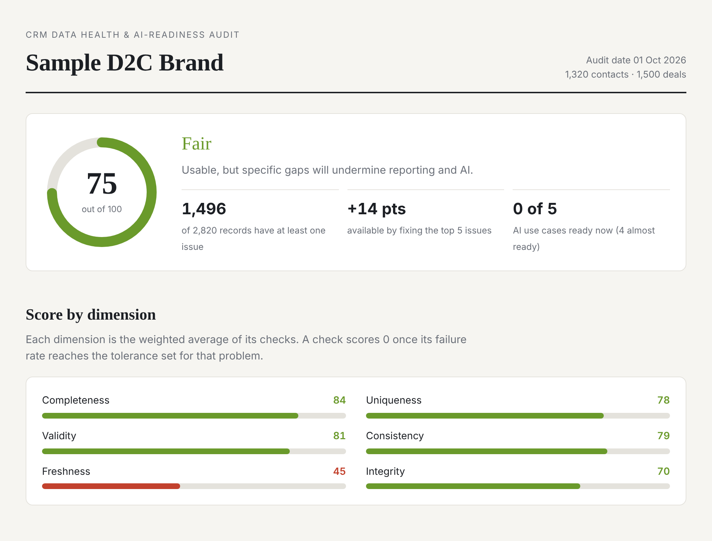

# CRM Data Health & AI-Readiness Audit

**Upload a CRM export → get a 0–100 health score, the problems costing you the most, and a verdict on whether your data can support AI.**

**▶ [Live demo](https://YOUR-APP.streamlit.app)** (sample data preloaded) · **[Sample report](reports/sample/report.html)**



Most companies already pay for a CRM, and most of that data is quietly broken: duplicates, missing fields, stale pipelines, five spellings of "Mumbai". In Validity's 2025 survey, 76% of CRM users said less than half their CRM data is accurate and complete. Meanwhile every CRM vendor is selling AI features that depend on that data being good.

This tool answers two questions a business owner actually cares about:

1. **How healthy is our CRM data, and what should we fix first?**
2. **Is it good enough for the AI we're being sold — lead scoring, churn prediction, forecasting, AI agents?**

---

## What it checks

| Dimension | Weight | Example checks |
|---|---|---|
| Completeness | 25% | Missing email, phone, industry, lead source, owner, deal amount |
| Uniqueness | 20% | Duplicate people (email / phone / fuzzy name within company), repeated IDs |
| Validity | 15% | Malformed emails, undialable phones, ≤0 deal amounts, future dates |
| Consistency | 15% | "Bombay" vs "Mumbai", "BFSI" vs "Financial Services", "closed won" vs "Closed Won" |
| Freshness | 15% | Contacts untouched for 12 months, no logged activity, open deals past their close date |
| Integrity | 10% | Deals linked to deleted contacts, won deals with no revenue, deals closing before they were created |

**Scoring is deliberately transparent:** each check scores `100 × (1 − failure rate ÷ tolerance)`, dimensions are weighted averages of their checks, and every issue is ranked by **how many overall points fixing it would recover**.

## AI-readiness audit

Clean data isn't automatically ML-ready data. Each use case is graded 🟢 Ready / 🟡 Almost / 🔴 Not ready against its own requirements:

| Use case | What it checks |
|---|---|
| Lead & deal scoring | Closed-deal volume, **class imbalance** (are lost deals being logged?), feature coverage, label hygiene, **target leakage** |
| Churn prediction | Customer count, repeat-purchase history, history length, duplicates splitting customer histories, engagement signals |
| Customer lifetime value | Revenue on won deals, transaction history, repeat buyers, revenue linked to real customers |
| Sales forecasting | Clean deal timelines, months of history, **stale pipeline**, close-date coverage |
| AI sales assistant / agents | Reachable contacts, interaction history, ownership, duplicates |

**Target-leakage scan:** flags any field that predicts won/lost almost perfectly on its own — e.g. a `probability` field auto-set to 100% on close, or a `lost_reason` only filled in for lost deals. These make a model look brilliant in testing and fail on live deals. A generic data-quality tool won't catch this.

## Validated against planted errors

The repo includes a generator that builds a realistic messy CRM (1,320 contacts, 1,500 deals) and **logs every problem it plants**. The audit is then scored on what it catches:

| | Result |
|---|---|
| Overall recall (planted issues caught) | **96.6%** |
| Overall precision (flags that are real issues) | **99.9%** |
| Duplicate detection | 99.2% recall / 99.2% precision |

The misses are deliberate: label variants like "Dilli" or "Hotels" aren't in the synonym dictionary or close enough to fuzzy-match, and the tool doesn't guess.

## Quick start

```bash
pip install -r requirements.txt

# 1. build the messy sample CRM (optional — it's already in sample_data/)
python generate_sample_data.py

# 2. command line: writes report.html, audit.json, flagged_records.csv
python run_audit.py --contacts sample_data/contacts.csv --deals sample_data/deals.csv \
    --client "Sample D2C Brand" --as-of 2026-10-01 --truth sample_data/injected_issues.csv

# 3. web app
streamlit run app.py

# tests
python -m pytest -q
```

Works with exports from HubSpot, Zoho, Salesforce and Pipedrive. Column names are auto-mapped (`Email Address`, `Create Date`, `Deal Stage`, `Opportunity Amount`…), `.csv` and `.xlsx` are both accepted, and checks whose columns are missing are reported as "not assessed" rather than failing.

## Outputs

- **`report.html`** — client-ready report: score, dimension breakdown, top 5 issues with impact and fix, AI-readiness verdicts, method. Prints cleanly to PDF.
- **`flagged_records.csv`** — every flagged record with the check it failed, so issues can be fixed at source.
- **`audit.json`** — machine-readable results for tracking the score month over month.

## Project structure

```
crm_audit/
  schema.py      column auto-mapping, missing-value and stage normalisation
  checks.py      the six dimensions of checks (incl. fuzzy duplicate clustering)
  scoring.py     check → dimension → overall score, points recoverable
  readiness.py   AI-readiness use cases + target-leakage scan
  audit.py       run_audit() entry point
  report.py      HTML report
  synthetic.py   messy CRM generator with ground-truth issue log
  evaluate.py    precision/recall against planted issues
app.py           Streamlit front end
run_audit.py     command line
tests/           pytest suite
```

## Roadmap

- [ ] Auto-clean step (merge duplicates, standardise labels) with a before/after score
- [ ] Direct HubSpot / Zoho API connectors instead of CSV exports
- [ ] Monthly score tracking dashboard
- [ ] Operational modules: smart lead routing, auto data capture from emails

## Methodology notes

- Duplicates: union-find clustering over exact email match, last-10-digit phone match, and fuzzy name matching (RapidFuzz) within the same normalised company. The oldest record in each cluster is treated as the one to keep.
- Inconsistent labels: case/punctuation normalisation → synonym dictionary → fuzzy merge of rare spellings into frequent ones; the most common raw spelling in each group is the standard.
- Leakage: for each field, the share of the gap between the majority-class baseline and perfect prediction that the field closes on its own; ≥ 0.9 is flagged.
